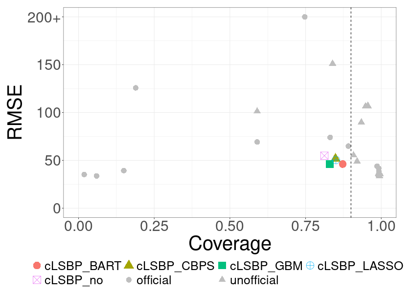
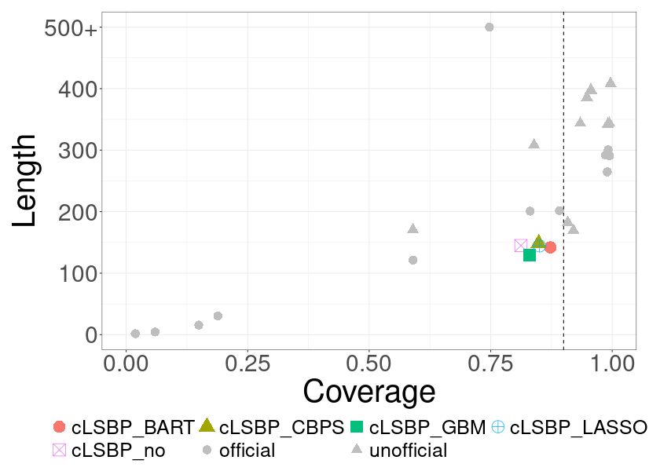
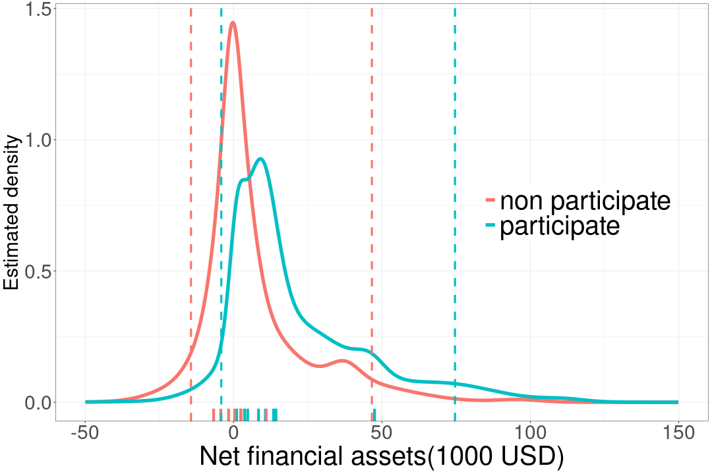

[Home](/) · <!--[Research](/research) ·-->[cLSBP](/clsbp)

# cLSBP: causal Logistic Stick-Breaking Process

<!--

Here I summarize the model, posterior computation, and key empirical results
from our work on the causal logistic stick-breaking process (cLSBP).

## 1. Motivation

- Heterogeneous treatment effects in observational studies  
- Limitations of parametric models and standard BART / BCF

## 2. Model overview

- Logistic stick-breaking prior on latent cluster assignments  
- Outcome model, treatment model (if you want), etc.
- Pólya–Gamma augmentation for efficient posterior computation

-->

<!-- Maybe some cake plots for LSBP-->

## 4-1. ACIC 2022 data competition

### UTE estimation

  
  
<strong>(a)</strong> COV vs RMSE

  
  
<strong>(b)</strong> COV vs LEN

**Summary:**  
cLSBP-based methods showed strong performance in estimating individual unit treatment effects (UTEs), achieving low RMSE, good coverage near the nominal 90%, and short interval lengths. Performance was robust to the choice of propensity score estimator.

## 4-2. Posterior Predictive Distribution (401(k) Dataset)

  

  
<strong>(a)</strong> Posterior Predictive Distribution

**Summary:**  
This figure shows the posterior predictive distribution of net financial assets for a particular covariate value \(x^\star\).  
The rug plot displays the 16 observed outcomes(7 controlled, 9 treated) for households with \(x = x^\star\).  
**Dashed vertical lines represent the 90% credible intervals** for the predictive distributions under control (red) and treatment (blue).
The broad predictive uncertainty directly mirrors the fact that households sharing the same covariates can still vary greatly in their financial outcomes, indicating that cLSBP can adequately capture the variance.

## 5. Paper & code

- Preprint: [arXiv:2511.23085](https://arxiv.org/abs/2511.23085)  
- R package: TBD  
